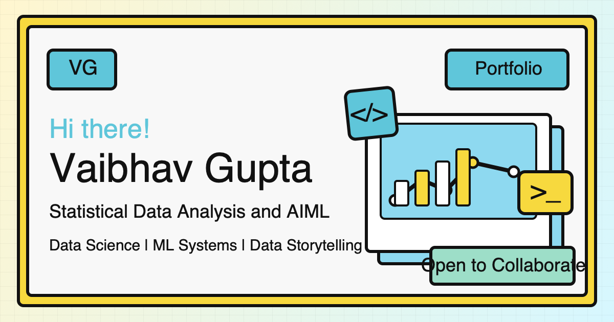

# Vaibhav Gupta Portfolio

	

	
	
	

A neo-brutalist personal portfolio built with vanilla HTML, CSS, and JavaScript. No frameworks, no build tools, no dependencies, just raw code with bold design choices.

This is a personal creative project, not a production template. The codebase is designed for experimentation, motion, and visual storytelling.

Live site: https://vaibhavgit5048.github.io/vaibhavgupta.me/

## What is Neo-Brutalism?

Neo-brutalism is a web style inspired by brutalist architecture: raw, bold, and intentionally expressive. Instead of soft gradients and polished minimalism, it embraces strong visual contrast:

- Thick black borders that define every block
- Flat offset shadows like solid color stamps
- High-contrast accent colors (yellow, cyan, pink, green)
- Exposed layout structure over over-smoothed UI patterns
- Hand-crafted details mixed with geometric precision

This portfolio leans into a scrapbook-inspired version of neo-brutalism with paper tear dividers, animated highlights, a flip-open journey map, and playful hero interactions.

## Design Decisions

### Color System

The palette is driven by CSS variables for consistent theming:

| Color | Variable | Usage |
|-------|----------|-------|
| Yellow | --yellow | Primary accent, CTAs, loader |
| Cyan | --cyan | Code elements, highlights |
| Pink | --pink | Secondary accent, highlights |
| Green | --green | Success states, highlights |
| Black | --border | Borders, shadows, text |

### Typography

- Space Grotesk for headings and body text
- Space Mono for technical and terminal elements
- Caveat for handwritten visual notes

### Signature Elements

- Paper tear transitions between sections
- Book-flip journey timeline reveal
- Scroll-driven highlighter animations
- Leaflet map with stylized journey markers
- Matrix-style hero greeting reveal
- Falling decorative SVG icons

## Terminal Mode

Open /terminal.html for an interactive terminal resume experience.

Features:
- Help command system and keyboard history
- Multiple themes (Default, Dracula, Solarized, Nord)
- Split panes (horizontal and vertical)
- Built-in Snake game powered by p5.js

## Project Structure

.
|- index.html          # Main portfolio page
|- neo-styles.css      # Styling for main page
|- terminal.html       # Terminal resume view
|- styles.css          # Terminal page styles
|- script.js           # Terminal commands and interactions
|- image/              # Visual assets
|- robots.txt          # Search engine directives
|- sitemap.xml         # SEO sitemap
|- README.md           # Repository documentation
|- LICENSE             # Usage terms

## Tech Stack

- HTML, CSS, JavaScript (vanilla only)
- Leaflet.js for map interactions
- p5.js for terminal mini-game
- Font Awesome for icons
- Google Fonts (Space Grotesk, Space Mono, Caveat, Fira Code)

## Run Locally

Any static server works.

Option 1:
npx serve .

Option 2:
python3 -m http.server 8000

## Ownership

Maintained by Vaibhav Gupta.

## License

This project is proprietary. All rights reserved. See LICENSE for usage terms.
